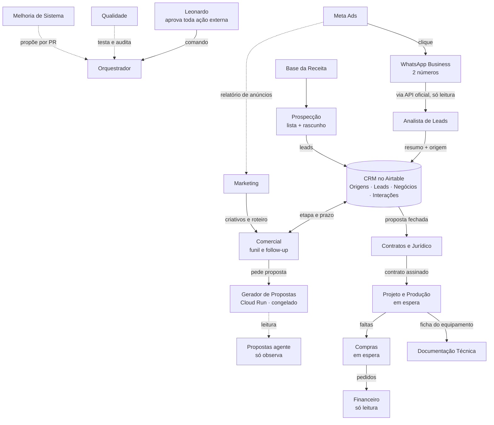

# Mapa de agentes e conexões

Versão visual (privada, só o Leonardo abre): https://claude.ai/artifact/QvCQMHtaQpipM4uM7MNZEr

Estado em 03/10/2026. **No ar:** CRM no Airtable e Gerador de Propostas. **Em andamento:** Comercial (planilha de follow-up). **Definidos:** Orquestrador, Analista de Leads, Marketing, Prospecção, Contratos e Jurídico, Propostas, Documentação Técnica, Financeiro, Qualidade, Melhoria. **Em espera:** Projeto e Produção, Compras.

Regras de todas as ligações: tudo sob pedido; nenhum agente envia mensagem, e-mail ou proposta ao cliente sozinho; dinheiro e fiscal, o agente prepara e uma pessoa aprova; dados de cliente ficam no Airtable e no Drive, nunca no GitHub.
